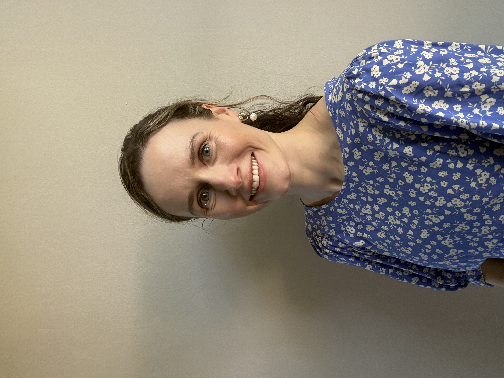

# Meet Your Faculty

<!--#### NAME

>JOB TITLE  
INSTITUTION  
LOCATION
>
> --- CONTACT INFO, IF PROVIDED

BIO GOES HERE-->

### Instructors

#### Zhibin Lu (he/him)

>Senior Manager, Digital Research  
University Health Network  
Toronto, ON, Canada 
>
> --- zhibin@gmail.com 

Zhibin Lu is a senior manager at University Health Network Digital. He is responsible for UHN HPC operations and scientific software. He manages two HPC clusters at UHN, including system administration, user management, and maintenance of bioinformatics tools for HPC4health. He is also skilled in Next-Gen sequence data analysis and has developed and maintained bioinformatics pipelines at the Bioinformatics and HPC Core. He is a member of the Digital Research Alliance of Canada Bioinformatics National Team and Scheduling National Team.

#### Aqsa Alam

>Bioinformatician III   
Ontario Institute for Cancer Research  
Toronto, Ontario, Canada 
>
> --- aalam@oicr.on.ca

Aqsa Alam is a bioinformatician in the Clinical Genome Interpretation team at the Ontario Institute of Cancer Research. Aqsa did her Honours BSc with high distinction in Biology and Physics at the University of Toronto Mississauga and her MSc in Cell and Systems Biology at the University of Toronto. Aqsa is passionate about communication and scientific outreach. Her current work focuses on genomic interpretation in cancer and supporting accredited clinical trials.
 

### Teaching Assistants

#### Oliver  De Sa

Bioinformatician III
Ontario Institute for Cancer Research
Toronto, Ontario, Canada
odesa@oicr.on.ca

Oliver De Sa is a bioinformatician in the Window-of-Opportunity (WOO) network at the Ontario Institute for Cancer Research. Oliver completed a BSc in Biochemistry, followed by an MSc in Immunology both at the University of Toronto. His current work focuses on multi-omic analyses for WOO clinical trials, integrating various data types to describe the molecular mechanisms through which the tumour microenvironment responds to treatment.

### Facilitator

#### Neha Ratti (she/her)

>Regional Coordinator, CBH Ontario  
Canadian Bioinformatics Hub, University Health Network   
Toronto, ON, Canada 
>
> --- ontario@bioinformatics.ca 

Neha is passionate about advancing bioinformatics and data science training across the province. With a strong background in project management, event coordination, and stakeholder engagement, she strives to create impactful initiatives that foster collaboration and skill development. Her experience in organizing training programs, developing policies, and building supportive environments enables her to contribute to Ontario’s leadership in the bioinformatics community. 

#### Sian Brooks (she/her)

>Regional Coordinator, CBH Ontario  
Canadian Bioinformatics Hub, University Health Network   
Toronto, ON, Canada 
>
> --- ontario@bioinformatics.ca 

Sian Brooks is the Ontario Co-Regional Coordinator for the Canadian Bioinformatics Hub. With over eight years of experience in the healthcare field and a background in office administration and event coordination, Sian brings a steady, detail-oriented approach to program delivery. She is committed to fostering a collaborative and supportive environment for trainees and researchers alike, helping to strengthen Ontario's standing within the national bioinformatics community.
